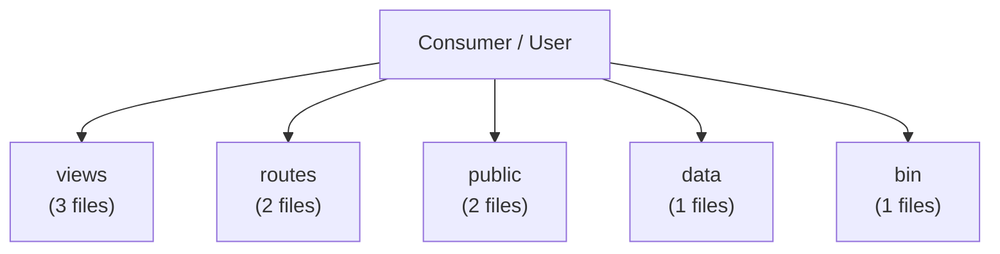

# Architecture

> _Auto-generated DeepWiki. Derived from static analysis of the repository at the referenced commit. Verify against source before relying on operational details._

**Repository:** [`rseshi1/cicd-pipeline-train-schedule-git`](https://github.com/rseshi1/cicd-pipeline-train-schedule-git)  
**Default branch:** `master`  
**Generated:** 2026-06-25 01:16 UTC

## System architecture

The architecture below is derived from the repository's top-level structure and
detected components. Each top-level directory is treated as a logical component.

## Component responsibilities

| Component | Inferred responsibility | Evidence (path) |
| --- | --- | --- |
| `views` | Project module / content | `views/` (3 files) |
| `routes` | Project module / content | `routes/` (2 files) |
| `public` | Project module / content | `public/` (2 files) |
| `data` | Project module / content | `data/` (1 files) |
| `bin` | Project module / content | `bin/` (1 files) |

## Design patterns & layering

- **Script-driven build** — npm scripts orchestrate build/test/run.

## Layer boundaries

- **Source / logic:** code files in the primary languages
  (JSON, JavaScript, CSS).
- **Configuration:** 1 config file(s) (see [Code Structure](code-structure.md)).
- **Infrastructure / deploy:** n/a.
- **Automation:** no CI detected.

See the [data flow](diagrams/data-flow.md) and
[deployment topology](diagrams/deployment.md) diagrams for runtime views.
