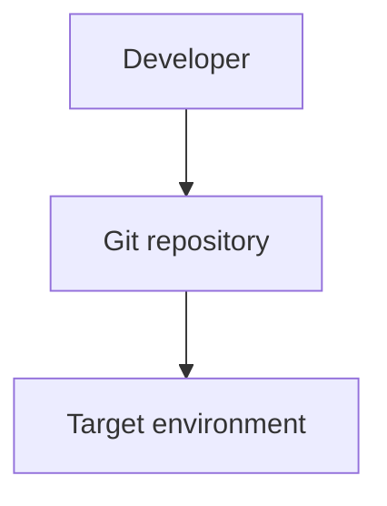

# Deployment

> _Auto-generated DeepWiki. Derived from static analysis of the repository at the referenced commit. Verify against source before relying on operational details._

**Repository:** [`rseshi1/cicd-pipeline-train-schedule-git`](https://github.com/rseshi1/cicd-pipeline-train-schedule-git)  
**Default branch:** `master`  
**Generated:** 2026-06-25 01:16 UTC

## Deployment model

Node.js application — deploy by installing dependencies and running the start script on a Node runtime or PaaS.

## Build process

- `npm install` to install dependencies.
- `npm start` to run the application.

## Deployment artifacts

| Type | Files |
| --- | --- |
| — | No deployment artifacts detected |

## Promotion / environments

Environment promotion is inferred from CI/CD configuration. Review
[`.github/workflows`](https://github.com/rseshi1/cicd-pipeline-train-schedule-git/tree/master/.github/workflows)
(none present) for the authoritative process.
