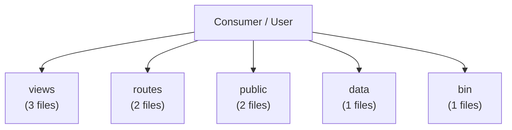

# Architecture Diagram

> _Auto-generated DeepWiki. Derived from static analysis of the repository at the referenced commit. Verify against source before relying on operational details._

```mermaid
graph TD
    U["Consumer / User"]
    C0["views<br/>(3 files)"]
    U --> C0
    C1["routes<br/>(2 files)"]
    U --> C1
    C2["public<br/>(2 files)"]
    U --> C2
    C3["data<br/>(1 files)"]
    U --> C3
    C4["bin<br/>(1 files)"]
    U --> C4
```
