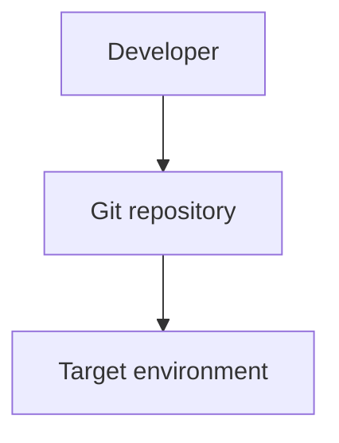

# Infrastructure

> _Auto-generated DeepWiki. Derived from static analysis of the repository at the referenced commit. Verify against source before relying on operational details._

**Repository:** [`rseshi1/cicd-pipeline-train-schedule-git`](https://github.com/rseshi1/cicd-pipeline-train-schedule-git)  
**Default branch:** `master`  
**Generated:** 2026-06-25 01:16 UTC

## Infrastructure-as-Code

_No Terraform detected._

## Kubernetes

_No Kubernetes manifests detected._

## Containers

_No container definitions detected._

## Configuration files

- `.gitignore`

## Topology

