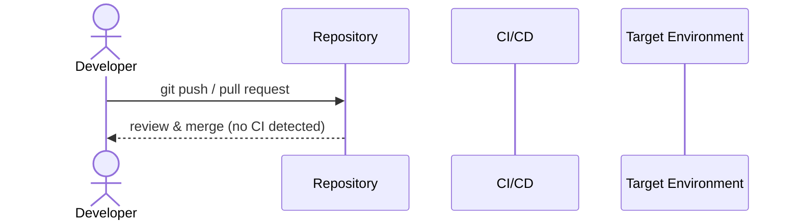

# Workflows

> _Auto-generated DeepWiki. Derived from static analysis of the repository at the referenced commit. Verify against source before relying on operational details._

**Repository:** [`rseshi1/cicd-pipeline-train-schedule-git`](https://github.com/rseshi1/cicd-pipeline-train-schedule-git)  
**Default branch:** `master`  
**Generated:** 2026-06-25 01:16 UTC

## Key workflows

This page describes the principal end-to-end workflows of the project, derived
from detected entry points, scripts and automation.

## Developer workflow

1. Clone the repository and review [`README.md`](https://github.com/rseshi1/cicd-pipeline-train-schedule-git).
2. Install dependencies — see [Dependencies](dependencies.md).
3. Make changes in the relevant component (see [Code Structure](code-structure.md)).
4. Run tests — see [Testing](testing.md).
5. Open a pull request; CI runs — see [CI/CD](ci-cd.md).

## Automation workflows

_No GitHub Actions workflows detected in `.github/workflows/`._

## Operational scripts

_None detected._
